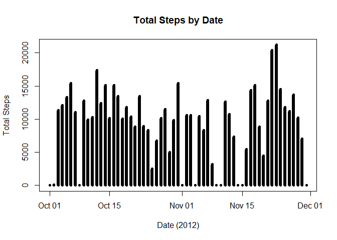
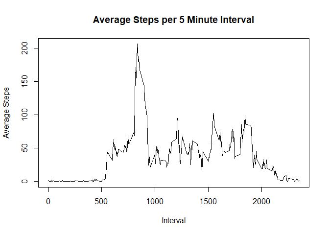
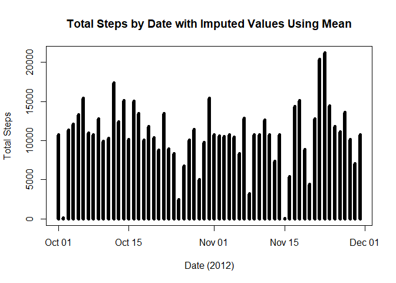
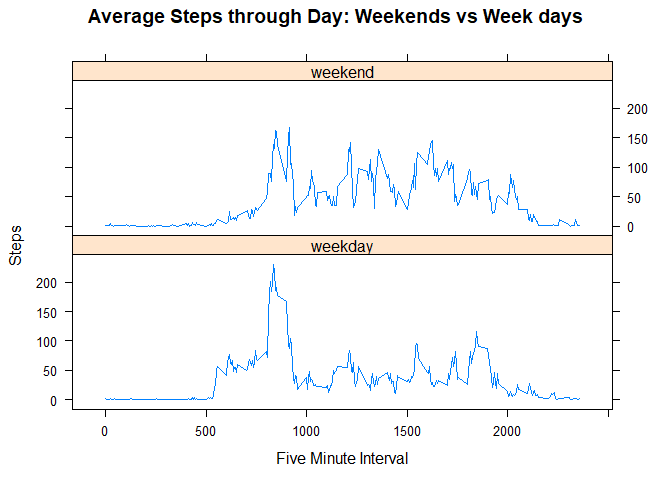

## Loading and preprocessing the data

```r
## Read data file, convert to "tibble", change date field from character to Date class
activity <- read.csv("activity.csv",stringsAsFactors = FALSE,na.strings="NA")
activity <- tbl_df(activity)
activity %>% mutate(date=as.Date(date)) -> activity
head(activity)
```

```
## # A tibble: 6 x 3
##   steps       date interval
##   <int>     <date>    <int>
## 1    NA 2012-10-01        0
## 2    NA 2012-10-01        5
## 3    NA 2012-10-01       10
## 4    NA 2012-10-01       15
## 5    NA 2012-10-01       20
## 6    NA 2012-10-01       25
```


## What is mean total number of steps taken per day?

```r
# Remove NA records for this step, then group by date.
activity %>% group_by(date) %>% summarize(daily_steps=sum(steps,na.rm=TRUE)) -> daily_activity

head(daily_activity)
```

```
## # A tibble: 6 x 2
##         date daily_steps
##       <date>       <int>
## 1 2012-10-01           0
## 2 2012-10-02         126
## 3 2012-10-03       11352
## 4 2012-10-04       12116
## 5 2012-10-05       13294
## 6 2012-10-06       15420
```

```r
plot(type="h",y=daily_activity$daily_steps,x=daily_activity$date,lwd=6,
    main="Total Steps by Date",xlab="Date (2012)",ylab="Total Steps")
```

<!-- -->

```r
## Compute daily mean and median
# Remove NA records for this step, then group by date.
activity %>% filter(!is.na(steps)) %>% group_by(date) %>%  summarize(daily_steps=sum(steps)) -> filtered_daily_activity
mean_daily_steps <- mean(filtered_daily_activity$daily_steps)
median_daily_steps <- median(filtered_daily_activity$daily_steps)
```

#### Mean Daily Steps = 10766.19  
#### Median Daily Steps = 10765  

## What is the average daily activity pattern?

```r
activity %>% filter(!is.na(steps)) %>% group_by(interval) %>%  summarize(interval_steps=sum(steps),steps_mean=mean(steps)) ->  interval_activity
plot(type="l",x=interval_activity$interval,y=interval_activity$steps_mean,
     main="Average Steps per 5 Minute Interval",
     xlab="Interval",ylab="Average Steps")
```

<!-- -->

```r
## What is the interval with the maximum average step count
max_interval <- interval_activity$interval[which.max(interval_activity$steps_mean)]
```
#### The interval with maximum average step count = 835   

## Imputing missing values

```r
missing<-summary(activity$steps)[["NA's"]]
```
### Number of NA observations = 2304  


```r
# Imputing missing values by taking mean of values for that interval, since steps seems to depend on interval
## Merge activity,interval_activity to get interval mean from steps_mean of interval_activity 
imp<-merge(activity,interval_activity,by="interval")
imp %>% mutate(imputed_steps=if_else(is.na(steps),steps_mean,as.double(steps))) -> mean_imp
# Get rid of intermediate columns, with imputed steps to replace steps
mean_activity<-select(mean_imp,steps=imputed_steps,date,interval)
#This is new activity data set. Steps per interval are now <double> to store mean
head(mean_activity)
```

```
##      steps       date interval
## 1 1.716981 2012-10-01        0
## 2 0.000000 2012-11-23        0
## 3 0.000000 2012-10-28        0
## 4 0.000000 2012-11-06        0
## 5 0.000000 2012-11-24        0
## 6 0.000000 2012-11-15        0
```


```r
mean_activity %>% group_by(date) %>% summarize(daily_steps=sum(steps,na.rm=TRUE)) -> mean_daily_activity

head(mean_daily_activity)
```

```
## # A tibble: 6 x 2
##         date daily_steps
##       <date>       <dbl>
## 1 2012-10-01    10766.19
## 2 2012-10-02      126.00
## 3 2012-10-03    11352.00
## 4 2012-10-04    12116.00
## 5 2012-10-05    13294.00
## 6 2012-10-06    15420.00
```

```r
plot(type="h",y=mean_daily_activity$daily_steps,x=mean_daily_activity$date,lwd=6,
    main="Total Steps by Date with Imputed Values Using Mean",
    xlab="Date (2012)",ylab="Total Steps")
```

<!-- -->

```r
merged_daily_activity<-merge(daily_activity,mean_daily_activity,by="date")
names(merged_daily_activity) <- c("date", "daily_steps_NAs", "daily_steps_imputed_mean")
```


```r
## Compute new daily mean and median with imputed values
mean_daily_steps_imp <- mean(merged_daily_activity$daily_steps_imputed_mean)
median_daily_steps_imp <- median(merged_daily_activity$daily_steps_imputed_mean)
```
#### Mean Daily Steps = 10766.19 
compared to 10766.19  

#### Median Daily Steps = 10766.19  
compared to 10765  

The mean did not change sine I was using the mean to fill in missing values and whole days were missing. It wuld ahve been different if just occasional interval counts were missing.

The median changed slightly since there are now values for the missing days.  

## Are there differences in activity patterns between weekdays and weekends?

```r
## A little function to return type of day, e.g. weekday or weekend
## For USA, weekend days are "Saturday" and "Sunday"
day_type <- function(myDate) {
    day <- weekdays(myDate)
    if (day %in% c("Saturday","Sunday")) {"weekend"}
    else {"weekday"}
}
## Add column for day converting it to a factor 
mean_activity$day <- as.factor(sapply(mean_activity$date,day_type))
head(mean_activity)
```

```
##      steps       date interval     day
## 1 1.716981 2012-10-01        0 weekday
## 2 0.000000 2012-11-23        0 weekday
## 3 0.000000 2012-10-28        0 weekend
## 4 0.000000 2012-11-06        0 weekday
## 5 0.000000 2012-11-24        0 weekend
## 6 0.000000 2012-11-15        0 weekday
```

```r
mean_activity %>% group_by(interval,day) %>% summarize(interval_steps=mean(steps)) ->  interval_activity
with(interval_activity,
     xyplot(interval_steps ~ interval | day,
            layout=c(1,2),type="l",
            main="Average Steps through Day: Weekends vs Week days",
            xlab="Five Minute Interval",ylab="Steps"))
```

<!-- -->
